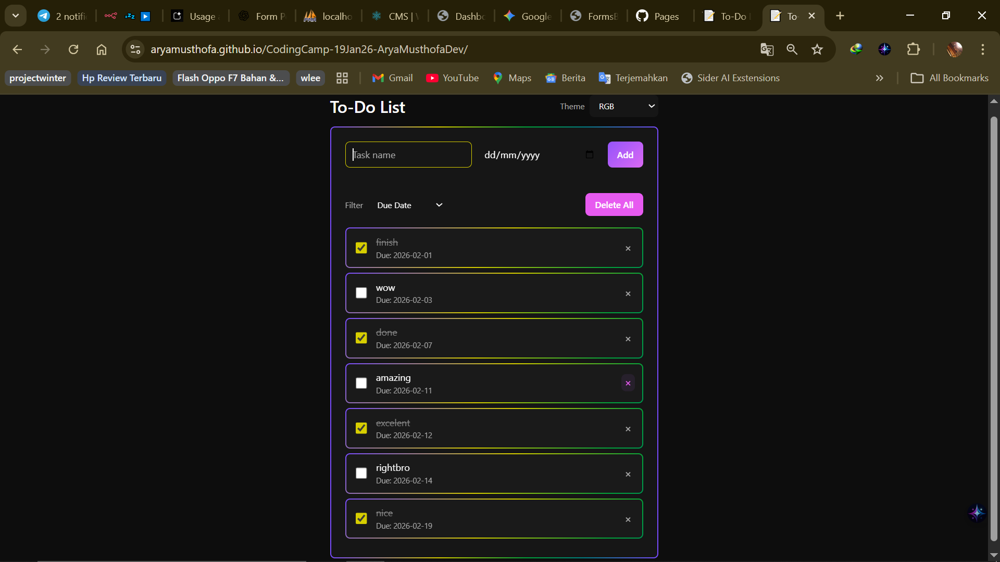
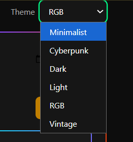
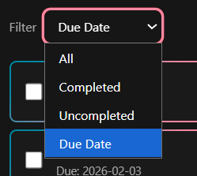
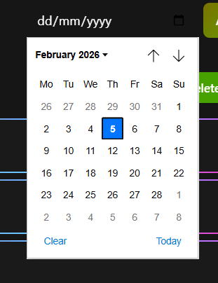

# To-Do List Web Application — "The Switcher Edition"

**🌐 Bahasa Indonesia** · [English](README.md)

*From Indonesian, Central Java 🇮🇩*

A responsive, themeable to-do list app with CRUD, filters, and 6 visual themes. Built with vanilla HTML, CSS, and JavaScript. Data and theme preference persist in `localStorage`.


> *Preview: RGB Mode & Cyberpunk Theme in Action*

**🌐 Live Demo:** [https://aryamusthofa.github.io/CodingCamp-19Jan26-AryaMusthofaDev/](https://aryamusthofa.github.io/CodingCamp-19Jan26-AryaMusthofaDev/)

---

## 📌 About This Project

Ini adalah **To-Do List Web Application** dengan fokus pada **CRUD**, **filter task**, dan **multi-theme**. Semua logic dan style di-pack dalam 3 file saja (satu HTML, satu CSS, satu JS) sesuai constraint project. Tema bisa diganti kapan saja dan pilihan tema + daftar task tersimpan di browser (localStorage), jadi tetap ada setelah reload.

---

## ✨ Features

| Feature | Description |
|--------|-------------|
| **Add Task** | Input nama task + due date (tanggal jatuh tempo). Validasi: nama wajib diisi (alert + pesan error di UI). |
| **Display List** | Tiap task menampilkan: nama, due date, checkbox selesai, dan tombol hapus. |
| **Mark Completed** | Centang checkbox → teks task dicoret (strikethrough). |
| **Delete** | Hapus satu task atau **Delete All** (dengan konfirmasi). |
| **Filter** | Dropdown: **All**, **Completed**, **Uncompleted**, **Due Date** (urut berdasarkan tanggal terdekat). |
| **Theme Switcher** | 6 tema (dropdown di kanan atas). Pilihan tema disimpan di localStorage. |
| **Responsive** | Layout card centered, nyaman di mobile dan desktop. |

---

## 🎨 Themes

Semua tema diatur lewat **CSS Variables** dan atribut `data-theme` pada `<body>` di satu file `css/style.css`.

| Theme | Kesan |
|-------|--------|
| **Minimalist** (default) | Putih/abu-abu, font Inter, shadow halus. |
| **Cyberpunk** | Background gelap, aksen neon pink/biru, efek glitch saat hover, font Courier. |
| **Dark** | Abu-abu gelap, teks putih lembut, nyaman di mata. |
| **Light** | Kontras tinggi: putih + hitam, border tegas. |
| **RGB** | Border/gradient animasi, nuansa gaming. |
| **Vintage** | Background sepia/beige, teks coklat, font serif/typewriter. |


> *Theme dropdown — pilih salah satu dari 6 tema (Minimalist, Cyberpunk, Dark, Light, RGB, Vintage).*

---

## 📋 Filter

Dropdown filter untuk melihat task: **All**, **Completed**, **Uncompleted**, atau **Due Date** (urut berdasarkan tanggal terdekat).


> *Filter dropdown — opsi Due Date mengurutkan task berdasarkan tanggal jatuh tempo.*

---

## 📅 Due Date (dd/mm/yyyy)

Setiap task bisa punya **tanggal jatuh tempo**. Input date memakai `type="date"`; di browser akan muncul date picker (kalender) untuk pilih tanggal.


> *Date picker — pilih due date saat menambah atau mengatur task.*

---

## 🛠 Tech Stack & Structure

- **HTML5** — struktur semantic, form, filter, theme switcher.
- **CSS3** — variables (`:root` + `[data-theme="..."]`), layout card, responsive.
- **Vanilla JavaScript** — CRUD, filter, theme logic, localStorage (tanpa framework).

**Struktur file (sesuai constraint):**

```
todolist-web-app/
├── index.html      # Main UI (form, filter, theme select, task list)
├── css/
│   └── style.css   # Semua style + 6 tema (satu file saja)
├── js/
│   └── script.js   # Semua logic (theme, CRUD, filter, localStorage)
└── README.md
```

---

## 🚀 How to Run

1. Clone atau download repo ini.
2. Buka di browser:
   - **Via server (XAMPP):** letakkan di `htdocs`, lalu akses `http://localhost/todolist-web-app/`
   - **Langsung:** buka file `index.html` (double-click atau drag ke browser).
3. Tambah task, coba filter, ganti tema — pilihan tema dan daftar task akan tetap setelah refresh.

Tidak perlu install dependency; cukup browser modern.

---

## 📂 Repo Naming (GitHub)

Saat push ke GitHub, nama repo disarankan mengikuti format:

```text
CodingCamp-19Jan26-[NamaLengkapKamu]
```

Ganti `[NamaLengkapKamu]` dengan nama kamu.

---

## 📋 Spec Reference (Original Brief)

- **Constraint:** Hanya 3 file utama: `index.html`, `css/style.css`, `js/script.js`. Tidak ada file tambahan.
- **Validation:** Task name wajib; kosong → tampil alert dan/atau pesan error di UI.
- **Persistence:** Daftar task dan tema disimpan di `localStorage`.
- **Theme:** Wajib pakai CSS Variables dan `data-theme` di body; semua tema dalam satu `style.css`.

---

Kalau mau nambah fitur atau ubah tema, tinggal edit `style.css` dan `script.js`. Semoga mantap pas di-up di GitHub. 🚀
